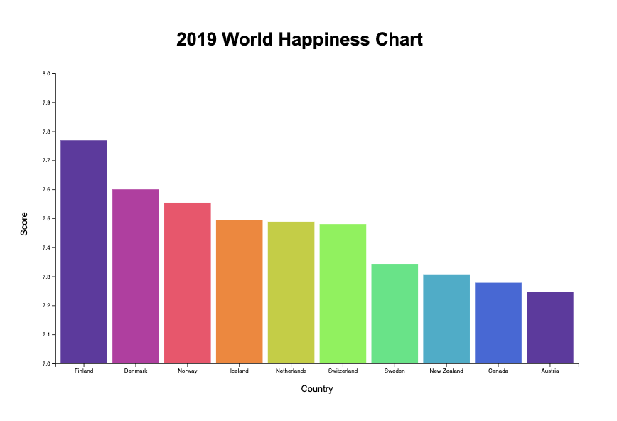

# ACS 4310 Final Assessment - World Happiness Bar Chart

This project is the final assessment for ACS 4310, and it involves creating a data visualization bar chart to display world happiness data for the top ten happiest countries. The bar chart will provide insights into the happiness levels of different countries around the world.

## How to Run
To explore the visualization, follow these steps:

1. Clone the repository to your local machine.
2. Open the project files in your preferred web browser.
